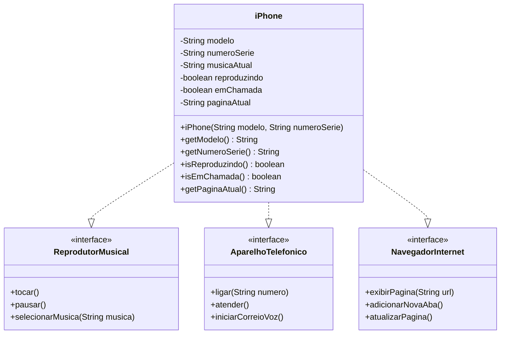

# Desafio iPhone - DIO

Este projeto apresenta uma modelagem e implementação em Java das funcionalidades do iPhone com base no vídeo de lançamento de 2007, atendendo aos requisitos do desafio da DIO.

## Diagrama UML



## Estrutura do Projeto

O projeto está organizado da seguinte forma:

- `ReprodutorMusical.java`: Interface que define os comportamentos de um reprodutor musical
- `AparelhoTelefonico.java`: Interface que define os comportamentos de um aparelho telefônico
- `NavegadorInternet.java`: Interface que define os comportamentos de um navegador de internet
- `iPhone.java`: Classe que implementa todas as interfaces, representando o iPhone
- `Main.java`: Classe de demonstração com método main para testar as funcionalidades

## Funcionalidades Implementadas

### Reprodutor Musical
- `tocar()`: Inicia a reprodução da música atual
- `pausar()`: Pausa a reprodução da música atual
- `selecionarMusica(String musica)`: Seleciona uma música para reprodução

### Aparelho Telefônico
- `ligar(String numero)`: Realiza uma chamada para o número especificado
- `atender()`: Atende uma chamada telefônica recebida
- `iniciarCorreioVoz()`: Inicia o serviço de correio de voz

### Navegador na Internet
- `exibirPagina(String url)`: Exibe uma página da web
- `adicionarNovaAba()`: Adiciona uma nova aba no navegador
- `atualizarPagina()`: Atualiza a página atualmente em exibição

## Como Executar

Para executar este projeto, compile os arquivos Java e execute a classe Main:

```bash
javac -d . *.java
java Main
```

## Referências

- [Vídeo de lançamento do iPhone (2007)](https://www.youtube.com/watch?v=9ou608QQRq8)
- [Trilha Java Básico - DIO](www.dio.me)
